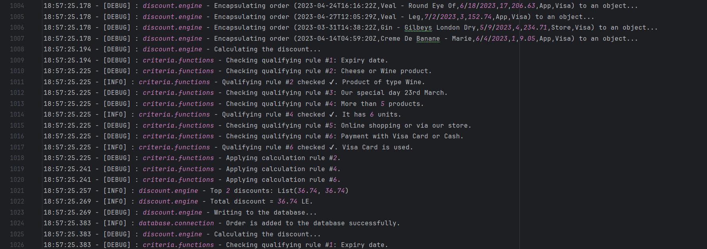

# Building-a-Flexible-Discount-Engine-for-a-Retail-Store-with-Scala

## Overview ##

A huge retail store wants a rule engine that qualifies orders' transactions to discounts based on a set of *qualifying rules* and automatically calculates the proper discount based on some *calculation rules*. The program is written in __Scala__ in a pure functional manner.

## Business Requirements ##

As mentioned above, the retail store has many orders to add discount  to them according to a specific criteria. This criteria has many *qualifying rules* and each *qualifying rule* has a *calculation rule* to be applied on the orders that meets this qualifying rule. It's a hard process to be implemented manually, so a discount engine is used to ease this process and make changing the criteria a more flexible action.

__Let's dig deeper into the discount engine qualifying rules and their corresponding calculation rules:__

  
  
<em>Discount Engine Criteria: Qualifying Rules and their corresponding Calculation Rules</em>

__Extra Rules:__

* Transactions that didn't qualify to any discount will have 0% discount.
* Transactions that qualified to more than one discount will get the average of the top 2 discounts.

Business also needs a new file that contains all orders' information besides the final price after passing the orders through our discount engine.

## Technical Requirements ##

Our discount engine needs to be written in __Scala__. Scala supports many programming paradigms, *Imperative Programming*, *Functional Programming*, and *OOP*.

But, to have this discount engine to be more flexible in enhancement, the code needs to be written in __pure functional manner__. So many technical requirements need to be satisfied by our code:

* No mutable variables or data structures allowed
* No loops allowed
* All functions must be pure:
    * Output depends solely on input
    * Inputs to the functions don't get mutated
    * Have a predictable behavior
    * No side effects

So in this project, I'll to write some code in __Scala__ with *Functional Programming Paradigm* to implement this __Discount Engine__ so that our Retail Store can use it, add discounts to orders, and get their customers' satisfaction!

## Data Source ##

Data source is simply a *csv* file which contains some orders' information such as:
* Order's date and time
* Product name of this order
* Expiry date of the product
* Quantity of the product
* Unit price of the product
* Channel of the order &rarr; Store - App
* Payment method &rarr; Cash - Visa

To explore the data and download it please check [TRX1000.csv](data/TRX1000.csv) file.

## Code Explaination ##

The program's code is divided into `3` files, [DiscountEngine](codes/DiscountEngine.scala), [CriteriaFunctions](codes/CriteriaFunctions.scala), and [DBConnection](codes/DBConnection.scala).

* __`DiscountEngine`__: Has the main flow of the program.
    * Reading the orders' data from a `csv` file
    * Parsing each line as an object of __Order__ datatype
    * Applying a list of qualifying and calculation rules paris to each order
    * Calculates the final discount of the order
        > Final discount is the average of the top 2 discounts.
    * Finally storing orders with *the price before discount* and *the final price after applying the discount* into an `Oracle table`.

* __`CriteriaFunctions`__: Has all the qualifying rules and their corresponding calculation rules.
    * All qualifying rules takes an object of __Order__ data type and returns `true` if it satisfies the rule, and `false` if not.
    * All calculation rules takes an object of __Order__ data type (that satisfied the corresponding qualifying rule) and returns a `decimal` value which represents the discount that may be applied on that order.

* __`DBConnection`__: Has the database functionalities such as *openning a database connection*, *writing into __Orders__ table*, and *closing the connection*.

In [codes](codes/) directory, there's another `sql` file which is [OrdersTable](codes/OrdersTable.sql). It containes the creation code of the table on Oracle DBMS.

> __Note__: All codes are well-commented and all functions are well-explained using `scaladoc`.

## Logging Functionality ##

It was required to generate a *log* file which logs the engine's events. It's built using `scala-logging` library with the help of [scala-logging](https://github.com/lightbend-labs/scala-logging) repository.

My logging system has `3` loggers, `discount.engine`, `criteria.functions`, and `database.connection`. Also, it has `3` levels of logs, `info`, `debug`, and `error`.

Here's a snapshot of the log file:

  
  
<em>A snapshot from the log file of our Discount Engine</em>

Click here to explore the whole log file &rarr; [rules_engine.log](rules_engine.log)

## How to run the project ? ##

1. Download the project folder [DiscountEngine](IntelliJ/DiscountEngine/) under the [IntelliJ](IntelliJ/) directory.

2. Open it using __IntelliJ Community Edition__ software.

3. Download the required libraries under the [libraries](libraries/) directory.

    a. `ojdbc7-12.1.0.2` to connect to Oracle DBMS.
        
    > It's compatible with `Oracle Database 11g Express Edition Release 11.2.0.2.0` and `Java SE 8 - jdk8`. If you've another versions, find the proper JDBC version.

    b. `kotlin-stdlib-1.4.0`, `java-dotenv-5.2.2`, and `annotations-13.0` to hanle the environment variables. [Optional]

4. Import the libraries in IntelliJ through __Files &rarr; Project Structure &rarr; Modules &rarr; Dependencies__.

5. Replace your database credentials in the [.env](IntelliJ/DiscountEngine/src/main/scala/.env) file, or you can add them inside the [DBConnection](codes/DBConnection.scala) file itself by assigning them to the varibales.

6. Run the code, explore the data inserted into __Orders__ table in the database, investigate the [log file](rules_engine.log) for any information, and enjoy your __Discount Engine__ !